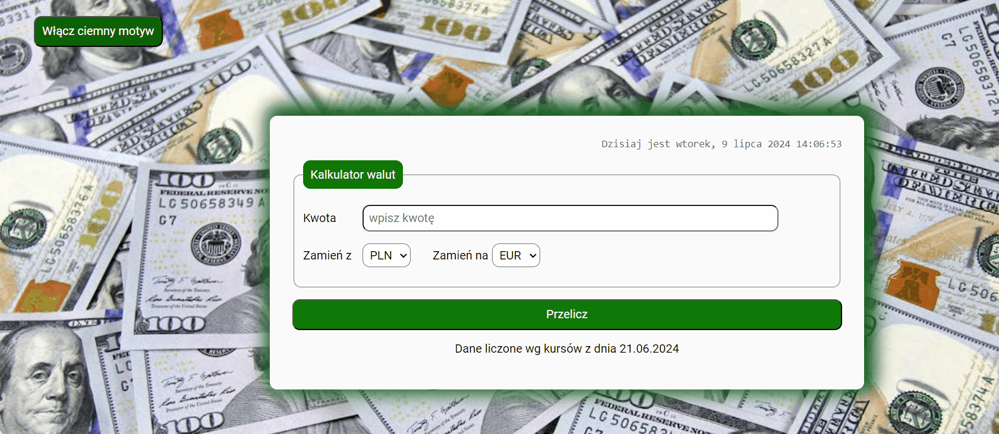

# CURRENCY CONVERTER

This project was bootstrapped with [Create React App](https://github.com/facebook/create-react-app).

## Demo
https://patryk-majchrzak.github.io/currency-converter-react/

## Description

Hi! Welcome to my currency converter, where you can convert pick currency you want to exchange from and currency you need to change for and calculate the result. Hope you enjoy it. Hope you'll enjoy it 😊 Below som information for users how to navigate through the website and information for developers about code itself. So, what are you waiting for? Click th link in the demo and try it out 😉

## Details for users

1. Website is available only in polish (I am about to add language selection in thee future, so it will be available in english as well)
2. You can change graphics by clicking "włącz ciemny  motyw" (enable dark motive) button. Button will now say "Włącz jasny motyw" (enable bright motive). If you click once again graphics will go back to default and button label will change once again to "włącz ciemny  motyw" (enable dark motive)

3. Currently there are four available currencies to chose from: PLN, WUR, USD and GBP
4. Input "kwota" (amount) has basic validation, it has to be fulfilled, amount has to be higher than 0.00, and it has to be round to 0.01
5. To use the currency converter just put the amount in "kwota" (amount) input, select currency you want to trade from "zamień z" (exchange from) select and currency you want to receive from "zamień na" (exchange to) select. Then click "przelicz" (calculate) button and message with the result will appear at the bottom.

## Details for developers

1. For naming classes for HTML mark-ups I've used BEM convention for any class I was using in CSS.
2. Hooks used: 
- useState
- useEffect
3. For setting the tim I combined useEffect, setIntervaal & clearInterval to create Interval that will show you dat with clock updating every second if Clock component exists and if not Interval will be immidiately cleared. This way unused intervals are cleared and code can be more efficient.

## Available Scripts

In the project directory, you can run:

### `npm start`

Runs the app in the development mode.\
Open [http://localhost:3000](http://localhost:3000) to view it in your browser.

The page will reload when you make changes.\
You may also see any lint errors in the console.

### `npm run build`

Builds the app for production to the `build` folder.\
It correctly bundles React in production mode and optimizes the build for the best performance.

The build is minified and the filenames include the hashes.\
Your app is ready to be deployed!

See the section about [deployment](https://facebook.github.io/create-react-app/docs/deployment) for more information.

### `npm run eject`

**Note: this is a one-way operation. Once you `eject`, you can't go back!**

If you aren't satisfied with the build tool and configuration choices, you can `eject` at any time. This command will remove the single build dependency from your project.

Instead, it will copy all the configuration files and the transitive dependencies (webpack, Babel, ESLint, etc) right into your project so you have full control over them. All of the commands except `eject` will still work, but they will point to the copied scripts so you can tweak them. At this point you're on your own.

You don't have to ever use `eject`. The curated feature set is suitable for small and middle deployments, and you shouldn't feel obligated to use this feature. However we understand that this tool wouldn't be useful if you couldn't customize it when you are ready for it.