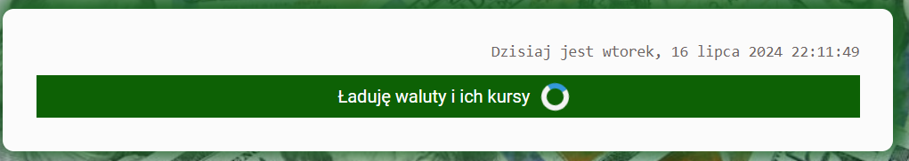
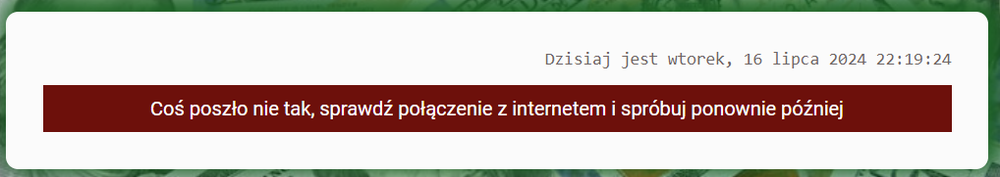
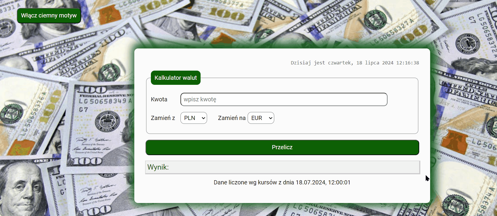
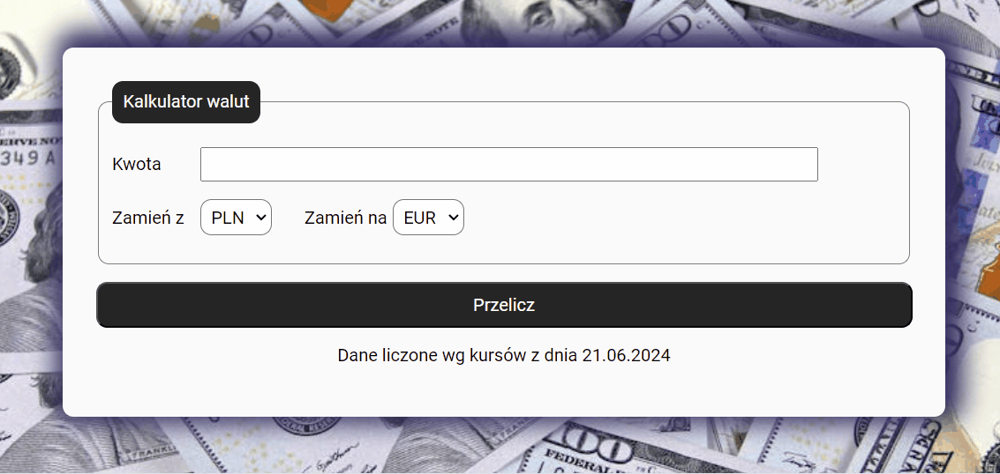
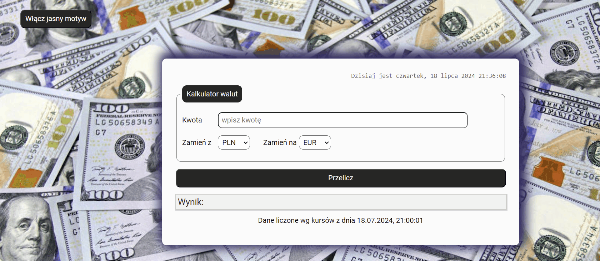

# CURRENCY CONVERTER

This project was bootstrapped with [Create React App](https://github.com/facebook/create-react-app).

## Demo
https://patryk-majchrzak.github.io/currency-converter-react/

## Description

Hi! Welcome to my currency converter, where you can convert pick currency you want to exchange from and currency you need to change for and calculate the result. Hope you enjoy it. Hope you'll enjoy it 😊 Below som information for users how to navigate through the website and information for developers about code itself. So, what are you waiting for? Click th link in the demo and try it out 😉

## Details for users

1. Website is available in polish and english. After first visit it will be displayed in polish, however you can change thee language by clicking on th appropiate flag at the top right language select section.

2. Before main app view will be displayed there will be 2 seconds of loading screen looking like this:

3. If there will be any potential issue with downloading currencies or dates below message will appear

4. You can change graphics by clicking "włącz ciemny  motyw" (enable dark theme) button. Button will now say "Włącz jasny motyw" (enable bright theme). If you click once again graphics will go back to default and button label will change once again to "włącz ciemny  motyw" (enable dark thme)

5. Currently there are 161 available currencies sorted in alphabetical order
6. Website is limited up to 1500 uses per month
7. Input "kwota" (amount) has basic validation, it has to be fulfilled, amount has to be higher than 0.00, and it has to be round to 0.01
8. To use the currency converter just put the amount in "kwota" (amount) input, select currency you want to trade from "zamień z" (exchange from) select and currency you want to receive from "zamień na" (exchange to) select. Then click "przelicz" (calculate) button and message with the result will appear at the bottom.

9. When you'll try to echange currencies right after changing currency from, you'll get message "Przelicza" (I calculate) for a second

## Details for developers

1. All components have been styled with styled-component library from NPM.
2. Whole app is put in ThemeProvider with appropiate themes for colors, box-shadows and breakpoints for max-width establishhed
3. Theme has some elements that are different for dark motive and some for light motive. Ones that are shared have been put in baseTheme object and copied to light and darkTheme
4. App has alternative box model defined in GlobalStyle
5. Hooks used: 
- useState
- useEffect
- custom hooks:
    - useCurrentDate
    - useThemeSelector
    - useGetDataFromAPI
    - useResultUpdate
6. For setting the tim I combined useEffect, setIntervaal & clearInterval to create Interval that will show you dat with clock updating every second if Clock component exists and if not Interval will be immidiately cleared. This way unused intervals are cleared and code can be more efficient.
5. Currencies and rates are downloaded from API (free version up to 1,500 requests)
6. Before data from API will be fetched, loading screen will appear (I added 2 seconds timeout, so it won't disappear imidiately)
7. If there will be any error with fetching the data custom error screen with user-friendly format will appear
8. Libraries i18next and react-i18next used to change website's language

## Available Scripts

In the project directory, you can run:

### `npm start`

Runs the app in the development mode.\
Open [http://localhost:3000](http://localhost:3000) to view it in your browser.

The page will reload when you make changes.\
You may also see any lint errors in the console.

### `npm run build`

Builds the app for production to the `build` folder.\
It correctly bundles React in production mode and optimizes the build for the best performance.

The build is minified and the filenames include the hashes.\
Your app is ready to be deployed!

See the section about [deployment](https://facebook.github.io/create-react-app/docs/deployment) for more information.

### `npm run eject`

**Note: this is a one-way operation. Once you `eject`, you can't go back!**

If you aren't satisfied with the build tool and configuration choices, you can `eject` at any time. This command will remove the single build dependency from your project.

Instead, it will copy all the configuration files and the transitive dependencies (webpack, Babel, ESLint, etc) right into your project so you have full control over them. All of the commands except `eject` will still work, but they will point to the copied scripts so you can tweak them. At this point you're on your own.

You don't have to ever use `eject`. The curated feature set is suitable for small and middle deployments, and you shouldn't feel obligated to use this feature. However we understand that this tool wouldn't be useful if you couldn't customize it when you are ready for it.